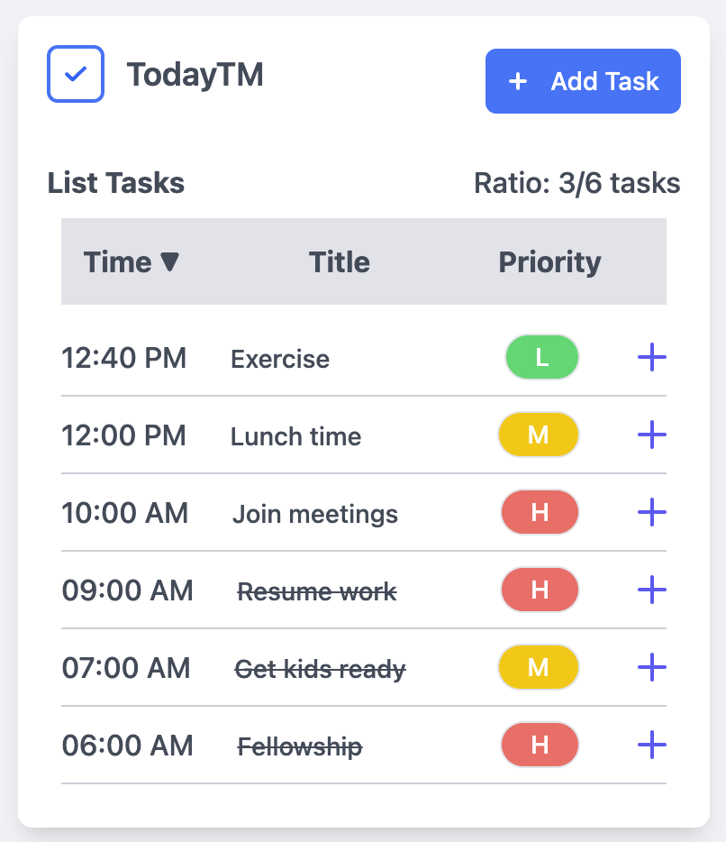
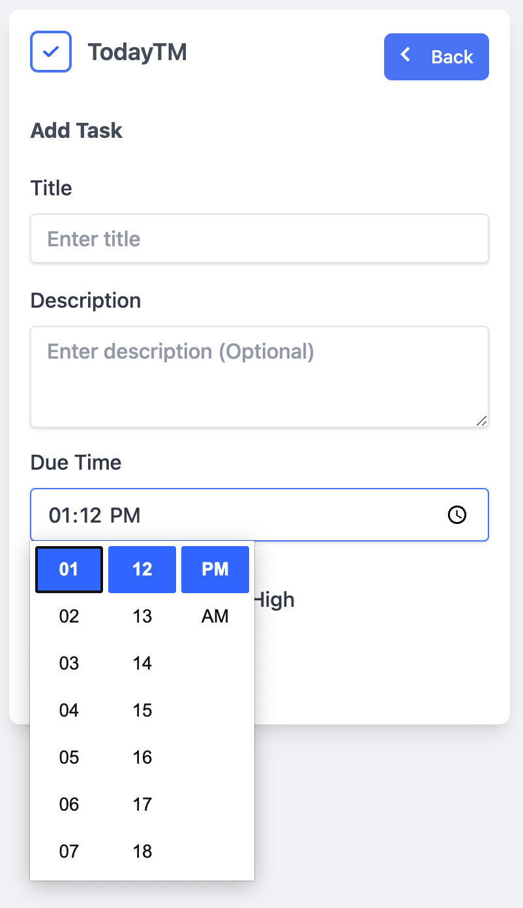
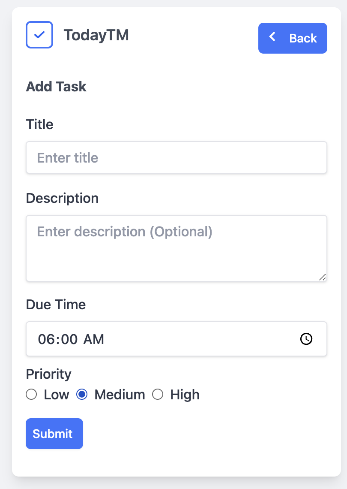

# TodayTM
## About the project
TodayTM is a minimal and simple task management application designed to help you efficiently manage all your daily tasks. The motivation behind this project is to demonstrate how to build and deploy a minimal and simple full-stack cloud-native application using modern and trending technologies such as React, Golang, and Kubernetes/OpenShift. 

## Setup the project
#### Running the application using `docker compose up`
- Clone the repository
- Run `docker compose up` to start the three services namely db, backend and frontend. The Docker Compose is use to orchestrate the Frontend, Go Backend API and MySQL services.
- The backend API is avaialable at "http://localost:4000" and frontend is at "http://localhost:300"

#### Running each services in the application separating
- Stop and remove the docker containers for the services if you ran `docker compose up` earlier
- Change to the project directory "/taskmanager/backend" and run `docker compose up` to start the MySQL server
```
cd /taskmanager/backend
docker compose up
```
- Change to the backend directory "/taskmanager/backend"
- Run `go get` to fetch and install backend dependencies
- Run `go run .` to start the Go backend API server on locahost port 4000
- Open another terminal, and change to "/taskmanager/frontend"
- Run `yarn && yarn dev` to launch the React frontend application on locahost port 3000.

## The TodayTM application featues and some screenshots
### List Tasks
The list tasks page is the main dashboard of the TodayTM application, where users can view and manage their tasks for the day. Users can also sort the task list in ascending or descending order, and the ratio of completed to uncompleted tasks is displayed on the right side. Users can toggle a task list item to display the details view, where they can see detailed information about a specific task, including its title, description, due date, and status, allowing them to prioritize their tasks effectively.





#### Add Task 
The add task page contains a form where users can input details for a new task, including the title, description, due date, and priority. The add form is disabled until the user enters at least a task title, and the default time is used if the time is not selected.





## Deploy the TodayTM fullstack application onto the OpenShift Container Platform
Since the motivation behind this project is for demonstration, we will deploy the application onto the OpenShift sandbox, which offers a free tier version for experimentation. See the following link on how to get free tier access to the OpenShift sandbox cluster.
- Build the backend and frontend applications using the `Dockerfile.prod` in each folder, and push to a registry of your choice.
- Update the images in the backend and frontend manifests to match the names of your Docker images.
 - Update the `<namespace>` in the k8-manifests files to match your project namespace.
- Log in to the OpenShift cluster. Get a token from the "Copy login command" in the profile menu on the Masthead toolbar. Copy the login command and execute it in a CLI terminal. Then apply the k8-manifests files that contain all the resources used for the deployment of the application. Alternatively, you can use the Import YAML (+) editor feature also located on the Masthead to upload the k8-manifests files.
- Create the database in the MySQL pod. You can use the Terminal tab on the pod details page to access the MySQL pod. Enter the MySQL username and password. See the syntax below:
  - Create the database in the MySQL pod container.
  - Exec into the MySQL pod container and run the following command:
    ```
    mysql -u root -p
    ```
  - Enter the password value encoded in the mysql-secret resource: password
    ```
    CREATE DATABASE taskmanager;
    ```
  Note, the name of the database should match the name in the mysql-secret.yaml.
- Finally, copy the backend exposed route. You can find it on the Route details page under the location field, and update the frontend deployment `env` variable `REACT_APP_BACKEND_URL` value to whatever your backend URL is. Then, wait for the update to take place or delete the frontend pod so that it is recreated with the updated `env` variable. Visit the frontend URL. You should see the running application.